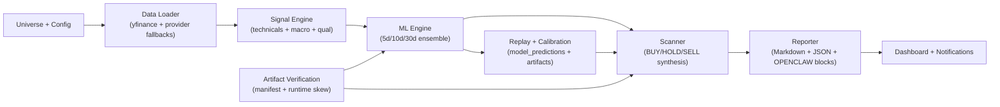

# MktML

<p align="center">
  
</p>

(/ˈmɑrkət mol/)

MktML is a local-first stock research pipeline that uses machine learning to generate daily BUY / HOLD / SELL recommendations. It pulls price data from up to 11 providers, trains an ensemble model across three time horizons (5-day, 10-day, 30-day), and produces human-readable reports you can act on or feed into other tools.

It runs entirely on your machine — no cloud account, no subscription, no data leaving your system.

## What does it actually do?

1. **Pulls market data** from yfinance and up to 10 fallback providers, so a single API outage never stops you.
2. **Computes signals** from technicals (RSI, MACD, Bollinger Bands, etc.), macro indicators (yield curve, VIX, credit spreads via FRED), and qualitative features (sector, moat, debt level).
3. **Trains an ensemble ML model** (Random Forest + Gradient Boosting + optional XGBoost) on 5-year history, scoring each ticker across 5d/10d/30d horizons.
4. **Scans your universe** and synthesizes a BUY/HOLD/SELL recommendation for every ticker, with calibrated confidence scores.
5. **Generates a daily report** (Markdown + JSON) with top picks, exit alerts for your holdings, and data-health checks.
6. **Tracks its own accuracy** via an audit system that records every recommendation and measures outcomes against SPY.

## Quick Start

```bash
# 1. Clone and set up
git clone https://github.com/smkwray/market.git
cd market
python3 -m venv .venv
source .venv/bin/activate
pip install -r requirements.txt

# 2. Configure
cp examples/public/config.public.example.py config.py
cp examples/public/.env.example .env
# Edit .env with your API keys (at minimum, get a free FRED key)
# Edit config.py to add your PORTFOLIO_HOLDINGS and WATCHLIST

# 3. Initialize and run
python src/main.py --init-db
python src/main.py --pipeline full
```

The full pipeline will: download data → compute signals → train models → scan → generate a report. First run takes longer (downloading 5 years of history); subsequent daily runs are much faster.

## Architecture



## CLI Reference

### Daily use

| Command | What it does |
|---|---|
| `python src/main.py --pipeline full` | Run everything end-to-end (data → train → scan → report) |
| `python src/main.py --pipeline daily` | Daily refresh (skip training, reuse existing model) |
| `python src/main.py --pipeline daily_auto` | Same as `daily` but designed for unattended/cron use |
| `python src/main.py --scan` | Scan only (generate recommendations from existing model) |
| `python src/main.py --report` | Regenerate the report from the latest scan results |

### Training and calibration

| Command | What it does |
|---|---|
| `python src/main.py --train-ml` | Retrain the ML models on current data |
| `python src/main.py --replay-scan --start YYYY-MM-DD --end YYYY-MM-DD` | Backtest: replay historical scans to build prediction history |
| `python src/main.py --build-calibration-artifacts --start YYYY-MM-DD --end YYYY-MM-DD` | Build probability calibration from replay data |
| `python src/main.py --verify-artifacts` | Check model/calibration artifact integrity |

### Audit and maintenance

| Command | What it does |
|---|---|
| `python src/main.py --audit` | Score past recommendations against actual outcomes |
| `python src/main.py --backfill-labels` | Backfill outcome labels for older recommendations |
| `python src/main.py --notify` | Send daily notification (webhook or ntfy) |
| `python src/main.py --notify-weekly` | Send weekly performance summary |

## Dashboard

A local web UI for controlling runs, viewing reports, and editing config:

```bash
python src/dashboard.py
# Open http://127.0.0.1:5050
```

From the dashboard you can:
- Start/stop any pipeline step (scan, train, audit, etc.)
- Schedule recurring jobs
- Browse reports and logs
- Edit config with history and rollback
- View live run status and analytics

## Data Providers

MktML tries providers in order until it gets data. If yfinance is down, it moves to Alpaca, then Tiingo, and so on. You don't need all of them — yfinance works with no API key. More providers = more resilience.

| Provider | Key needed? | What it provides |
|---|---|---|
| yfinance | No | Primary source for bulk price data |
| Alpaca | Yes | High-throughput OHLCV fallback |
| Tiingo | Yes | Daily bars fallback |
| Stooq | No | Public endpoint fallback |
| Twelve Data | Yes | CSV API fallback |
| Finnhub | Yes | Price data + fundamentals |
| Polygon | Yes | Price data + fundamentals |
| Alpha Vantage | Yes | OHLCV fallback (supports multiple keys) |
| FMP | Yes | Financial Modeling Prep fallback |
| EODHD | Yes | End-of-day historical fallback |
| FRED | Yes (free) | Macro indicators (VIX, yield curve, credit spreads) |

Set your keys in `.env` — see `examples/public/.env.example` for the full list.

### Gemini CLI (optional)

If all standard providers fail for a ticker, MktML can optionally call [Gemini CLI](https://github.com/google-gemini/gemini-cli) as a last resort to recover price data. It's also used for refreshing qualitative features (sector/industry classifications). Disabled by default if the binary isn't found.

## Reports and Agent Integration

Each scan produces a Markdown report with:
- Market regime summary (bull/bear/neutral based on macro signals)
- Data health stats (coverage, stale tickers, fetch failures)
- Top BUY and SELL recommendations with confidence scores
- Portfolio holdings status and exit alerts
- Watchlist updates

Reports include stable `OPENCLAW:SUMMARY` and `OPENCLAW:JSON` markers so downstream tools or AI agents can parse them programmatically. See `examples/public/market_report.sample.md` for the format.

## Notifications

Send daily or weekly summaries to:
- Any webhook endpoint (set `MARKET_NOTIFICATION_WEBHOOK_URL`)
- An [ntfy](https://ntfy.sh) topic (set `NOTIFICATION_NTFY_TOPIC`)

## How the ML Works

- **Ensemble**: Random Forest + Gradient Boosting + optional XGBoost, weighted and averaged.
- **Three horizons**: Separate models for 5-day, 10-day, and 30-day predictions.
- **Feature contract**: A strict ordered list of ~120 features ensures training and inference always use the same inputs. No silent drift.
- **Walk-forward validation**: Out-of-sample only, with purged/embargo-aware splits to prevent lookahead bias.
- **Calibration**: Probability outputs are calibrated per horizon so a "70% confidence" score means roughly 70% historical accuracy at that threshold.
- **Asset buckets**: Optionally trains separate models for equities, ETFs, and bonds when sample sizes are large enough.

## Extending MktML

| Want to... | Where to look |
|---|---|
| Add a new data provider | `src/data_loader.py` — add a downloader function and insert it into the fallback chain |
| Add new signal features | `src/signals.py` for technicals, `src/macro_loader.py` for macro, `scripts/update_qual_features.py` for qualitative |
| Add a new ML model type | `src/ml_engine.py` and `config.py` |
| Add a notification channel | `src/notifier.py` |
| Add dashboard controls | `src/dashboard.py` |

## Project Structure

```
src/
  main.py          Entry point and CLI
  data_loader.py   Multi-provider data acquisition with fallback
  signals.py       Technical indicator computation
  macro_loader.py  FRED macro data and regime features
  ml_engine.py     Model training, inference, and calibration
  scanner.py       BUY/HOLD/SELL recommendation synthesis
  reporter.py      Markdown + JSON report generation
  audit.py         Recommendation outcome tracking
  dashboard.py     Flask web UI
  notifier.py      Webhook and ntfy notifications
  storage.py       SQLite database layer
  universe.py      Ticker universe management
scripts/           Maintenance, migration, and utility scripts
examples/public/   Sanitized starter config and templates
```

## Performance Tuning

Threading is auto-configured based on your CPU count. Override with environment variables if needed:

- `CPU_RESERVED_CORES` — cores to leave free (default: 4)
- `ML_N_JOBS` — parallel jobs for model training
- `SCANNER_WORKERS` — parallel workers for data fetching

## Current Status

MktML is actively maintained and in daily use. The audit system is still accumulating samples for full statistical reliability — see `reports/public/` for current performance metrics.

## Publishing Safety

This repo is designed to be safe for public hosting. Credentials, portfolio data, reports, and logs are all gitignored. A pre-push hook (`scripts/public_push_guard.sh`) blocks accidental pushes of sensitive files. See `PUBLIC_RELEASE.md` for the full checklist.
