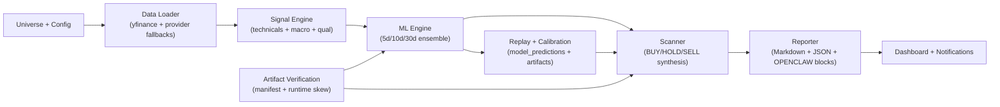

# MktML


/ˈmɑrkət məl/

MktML (Market ML Pipeline) is a production-oriented market research system for generating auditable BUY/HOLD/SELL recommendations with multi-horizon machine learning, robust data-provider fallback, and automation-ready reporting.

## What It Does

- Scans a broad ticker universe and scores signals across 5d, 10d, and 30d horizons.
- Trains an ensemble model (Random Forest + Gradient Boosting + optional XGBoost).
- Uses replay and calibration workflows to keep inference behavior reproducible.
- Verifies artifact integrity (manifest + runtime skew checks) before critical runs.
- Produces human-readable and agent-readable reports for daily decision workflows.
- Exposes an operational web UI for run control, scheduling, config updates, and monitoring.

## Architecture



## Feature Highlights

### Modeling and Signal Engine

- Multi-horizon confidence outputs: 5d, 10d, 30d.
- Ensemble inference with weighted RF/GBM/(optional) XGBoost.
- Strict feature contract (`ML_FEATURE_CONTRACT`) to prevent train/inference drift.
- Optional asset-bucket models (GLOBAL + EQUITY/ETF/BOND cohorts when sample thresholds are met).
- Walk-forward out-of-sample validation with purged + embargo-aware split support.
- Probability calibration artifacts per horizon plus calibrated threshold storage.

### Data Ingestion and Resilience

- Batch-first acquisition with automatic fallback across multiple providers.
- Per-provider token-bucket limits and circuit breakers to avoid thrashing on outages/rate limits.
- Missing-ticker recovery via parallel single-name fallback paths.
- Graceful degradation: if upstream providers fail, the pipeline continues with best available data.

### Replay, Calibration, and Verification

- Historical replay mode writes as-of predictions to `model_predictions`.
- Calibration builder can refresh replay rows when required and emit deterministic JSON artifacts.
- Artifact policy checks detect hash mismatches, missing entries, and forbidden runtime states.
- Manifest generation tracks model + calibration artifacts for reproducibility.

### Reporting and Agent Integration

- Daily markdown report with market summary, data health, top buys/sells, portfolio/watchlist views.
- Stable parser markers for downstream agents:
  - `OPENCLAW:SUMMARY`
  - `OPENCLAW:JSON`
- Compact AI payload export (`reports/ai_data_YYYY-MM-DD.json`) for lightweight automation consumers.
- Public performance summary artifacts under `reports/public/`.

### Operations and Web UI

- Flask dashboard at `http://127.0.0.1:5050`.
- Start/stop actions for scan, train, qual update, audit, weekly summary, and snapshot generation.
- Scheduling endpoints for scan/train/qual/audit/weekly/snapshot jobs.
- Live run monitor (`/api/run_monitor`) including process state and analytics throughput trends.
- Config editor with history + rollback APIs.
- Report/log browser and safe text previews.

## Supported Data Providers

MktML supports and chains multiple providers for OHLCV and fundamentals.

| Provider | Primary Use | Notes |
|---|---|---|
| `yfinance` | Fast batch baseline | First pass for bulk universe coverage |
| `Alpaca` | OHLCV fallback | API-key based, high-throughput fallback |
| `Tiingo` | OHLCV fallback | Token-based daily bars |
| `Stooq` | OHLCV fallback | Public endpoint fallback |
| `Twelve Data` | OHLCV fallback | CSV API fallback |
| `Finnhub` | OHLCV + fundamentals | Candles + metric endpoint |
| `Polygon` | OHLCV + fundamentals | Aggregates + ticker details |
| `Alpha Vantage` | OHLCV fallback | Supports key rotation list |
| `FMP` | OHLCV fallback | Financial Modeling Prep endpoints |
| `EODHD` | OHLCV fallback | End-of-day historical endpoint |
| `FRED` | Macro features | Macro regime feature inputs |

### Provider Credentials (Environment Variables)

- `ALPACA_API_KEY`, `ALPACA_SECRET_KEY`
- `ALPHA_VANTAGE_API_KEYS` (or `ALPHA_VANTAGE_API_KEY`)
- `FINNHUB_API_KEY`
- `POLYGON_API_KEY`
- `TIINGO_API_KEY`
- `TWELVE_DATA_API_KEY`
- `FMP_API_KEY`
- `EODHD_API_KEY`
- `FRED_API_KEY`

For public/shared setups, start from:

- `examples/public/.env.example`
- `examples/public/config.public.example.py`

### Fallback Chain

Batch fallback chain in `src/data_loader.py`:

`yfinance -> alpaca -> tiingo -> stooq -> twelve -> finnhub -> polygon -> alpha vantage -> fmp -> eodhd -> gemini-cli`

## Gemini CLI Integration

Gemini CLI is optional and used in controlled, fallback-oriented ways.

Expected binary names/paths are checked automatically (for example `gemini` / `gemini-cli` in common locations).

### 1) Last-ditch Price Recovery

- If all standard providers fail for plausible symbols, MktML can ask `gemini`/`gemini-cli` for batched OHLCV JSON.
- Uses strict parsing/validation and minimum bar count checks before acceptance.
- Controlled by config flags such as:
  - `ENABLE_GEMINI_PRICE_FALLBACK`
  - `GEMINI_PRICE_PRIMARY_MODEL`
  - `GEMINI_PRICE_FALLBACK_MODEL`
  - `GEMINI_PRICE_BATCH_SIZE`

### 2) Qualitative Feature Refresh

- `scripts/update_qual_features.py` uses Gemini CLI to refresh sector/industry/classification metadata.
- Includes strict taxonomy validation, confidence clamping, source checks, retry/repair flow, and model fallback behavior.
- Prioritizes refresh cadence by tier (portfolio, watchlist, broader universe).

### 3) Yield/Macro Supporting Workflows

- Project scripts support external refresh workflows for yield/macro-adjacent inputs (see `scripts/`).

## Quick Start

```bash
python3 -m venv .venv
source .venv/bin/activate
pip install -r requirements.txt
python src/main.py --init-db
python src/main.py --pipeline full
```

## Expected Next Results

This section is intended to be maintainer-updated as new evaluation data arrives.

- Latest evaluation date: `2026-02-19` (from `reports/public/model_performance_spy.md`; latest daily report is `2026-02-20`).
- Current benchmark-aligned sample count: `5` (target `20`; remaining `15`).
- Current BUY-outcome sample count: `6` (target `30`; remaining `24`).
- Next reliability milestone target: benchmark-aligned dates (`20`) are estimated around `2026-03-12` to `2026-03-13` assuming roughly one new aligned market-day sample per trading day.
- Expected next data availability: additional 5-day outcome data for the `2026-02-20` report should begin landing around `2026-02-27` (five trading days later).
- Notes: directional sample size already passes minimum (`241 >= 200`), while benchmark alignment and BUY-outcome slices are still early-sample and should be interpreted cautiously until those gates are met.

## Core CLI Commands

- Full pipeline: `python src/main.py --pipeline full`
- Daily pipeline preset: `python src/main.py --pipeline daily`
- Daily auto preset: `python src/main.py --pipeline daily_auto`
- Scan only: `python src/main.py --scan`
- Train only: `python src/main.py --train-ml`
- Report only: `python src/main.py --report`
- Replay scan: `python src/main.py --replay-scan --start YYYY-MM-DD --end YYYY-MM-DD`
- Build calibration artifacts: `python src/main.py --build-calibration-artifacts --start YYYY-MM-DD --end YYYY-MM-DD`
- Verify artifacts: `python src/main.py --verify-artifacts`
- Audit only: `python src/main.py --audit`
- Backfill recommendation outcomes: `python src/main.py --backfill-labels`
- Daily/weekly notifications: `python src/main.py --notify`, `python src/main.py --notify-weekly`

## Dashboard

Run locally:

```bash
python src/dashboard.py
```

Default URL: `http://127.0.0.1:5050`

Key capabilities:

- Job controls (`/run/scan`, `/run/train`, `/run/qual`, `/run/audit`, `/run/weekly_summary`, `/run/snapshot`)
- Scheduling controls (`/schedule`, `/train_schedule`, `/qual_schedule`, `/audit_schedule`, `/weekly_summary_schedule`, `/snapshot_schedule`)
- Config APIs (`/api/config`, `/api/config/history`, `/api/config/rollback`)
- Monitoring (`/api/run_monitor`) and file browsing (`/api/reports`, `/api/logs`, `/api/file_preview`)
- Public performance page (`/public/performance`)

## Notifications

Notification delivery supports:

- Generic webhook (`MARKET_NOTIFICATION_WEBHOOK_URL`)
- `ntfy` topic (`NOTIFICATION_NTFY_TOPIC`)

Daily and weekly notifications are built from latest public performance summary JSON.

## Performance and Parallelism

Threading is centralized in `config.py` with dynamic defaults:

- `TOTAL_CPU_CORES = os.cpu_count()`
- `RESERVED_CPU_CORES` default: `4`
- `N_JOBS` default: `TOTAL_CPU_CORES - RESERVED_CPU_CORES`
- `SCANNER_WORKERS` derived from `N_JOBS`

Override knobs:

- `CPU_RESERVED_CORES`
- `ML_N_JOBS`
- `SCANNER_WORKERS`

macOS BLAS/OpenMP caps are set to reduce oversubscription and nested parallel slowdown.

## Extensibility

MktML is intentionally modular. Typical extension points:

- New market data provider: add a downloader in `src/data_loader.py` and insert it into fallback order.
- New qualitative schema fields: extend `scripts/update_qual_features.py` and feature extraction in `src/ml_engine.py`.
- New model family or inference horizon: wire into `src/ml_engine.py`, `config.py`, and calibration/report paths.
- New report channels or notification targets: extend `src/reporter.py` and `src/notifier.py`.
- New dashboard controls: add routes in `src/dashboard.py` and UI bindings in the template.

## Public Release and Safety

Before publishing:

- Review `PUBLIC_RELEASE.md`.
- Use templates under `examples/public/`.
- Use generic launchd templates under `examples/public/launchd/` if scheduling on macOS.
- Do not publish raw `reports/`, `logs/`, `data/`, or local `config.py`.
- Verify git root: `git rev-parse --show-toplevel`.
- Enable push guard hook: `git config core.hooksPath .githooks`.
- Run guard: `scripts/public_push_guard.sh`.
